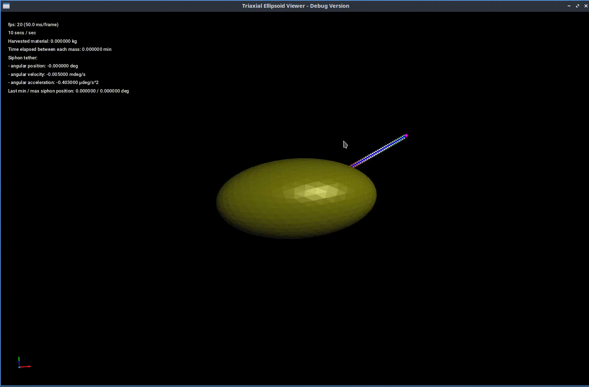
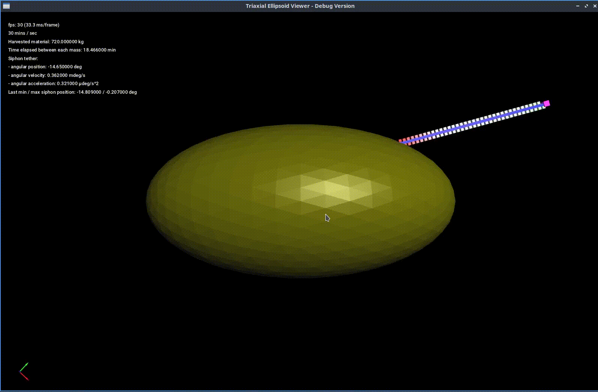
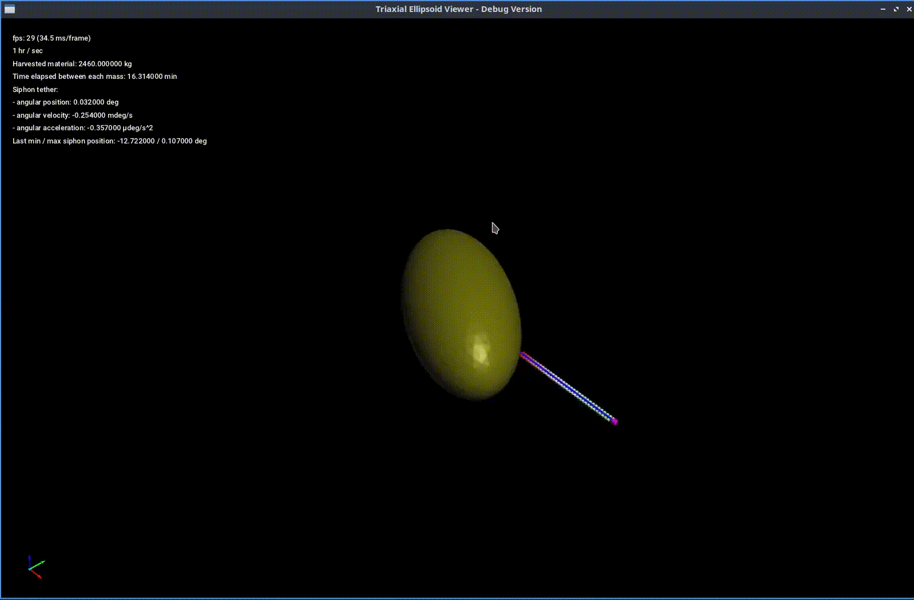
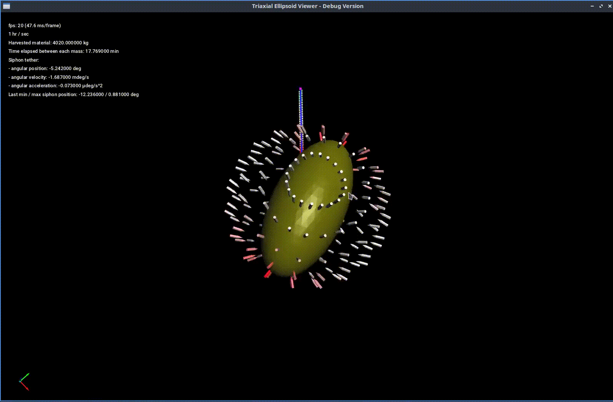
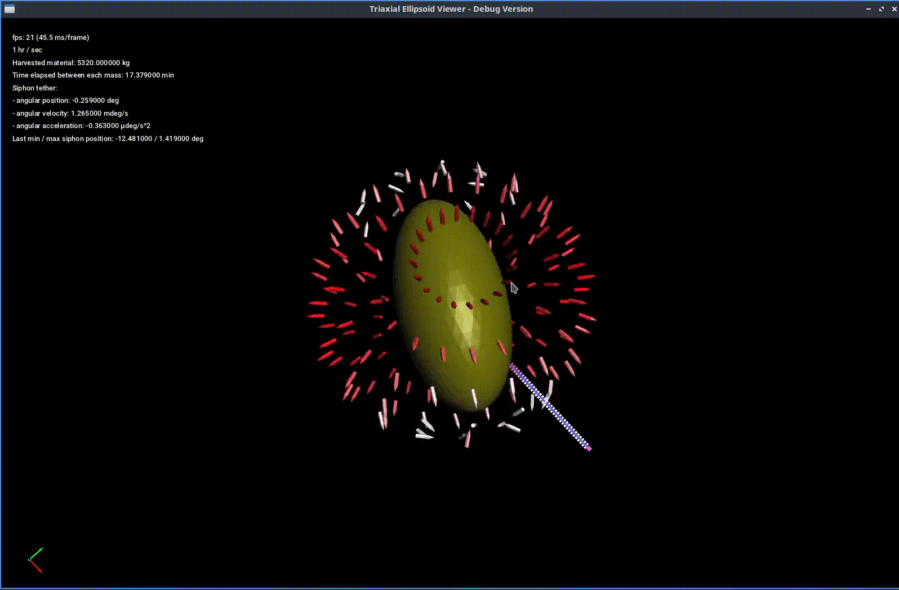
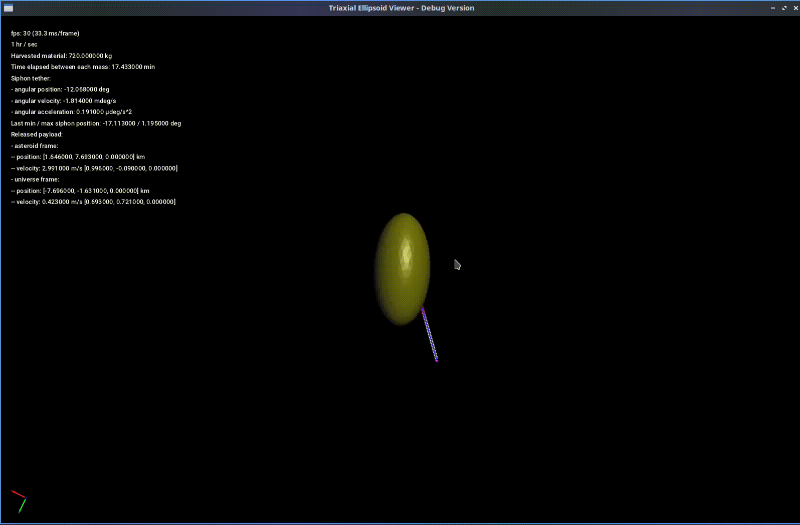
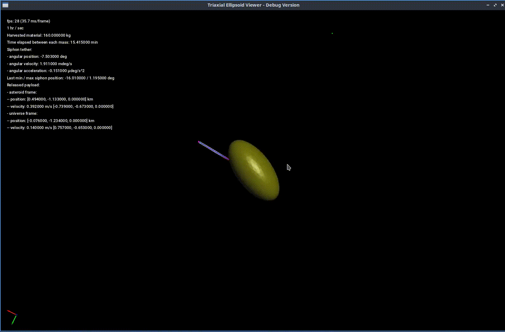
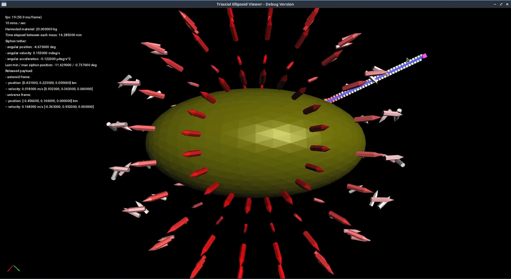

# asteroid_mining

This is a simulation of the dynamics of the orbital siphon effect of an
asteroid mining operation (i.e. attached to a rotating triaxial ellipsoid),
largely based off of the research from "Dynamics of an orbital siphon anchored
to a rotating triaxial ellipsoidal asteroid for resource exploitation" by Viale
et al. In short, the orbital siphon in this context is a means of extracting
resources from the host asteroid without using power to raise the mass off of
the surface, this is instead done so solely by utilizing the rotation of the
asteroid.

NB the commit history and code practices aren't my cleanest efforts, as this
was implemented (in its current state as of writing, commit
7e3c0b0dd618b284d3e9e545aca1559a89e8e6ed) in only a handful of days with a
tight deadline. Since then, I have started to come back, tidy things up, and
keep adding more to it.

# Description

## Overview

If there are visual artifacts in the README preview of the clips below in your
browser, the raw files in the `docs/media` directory are clearer.

The below clips are from a simulation of an asteroid model with the following
characteristics:
- Asteroid dimensions: 280 km x 140 km x 140 km
- Asteroid density: 2500 km/m^3
- Asteroid rotational velocity: ~3.5E-4 rad/s
- Payloads per side of siphon: 35
- Siphon chain length: 270 km
- Bucket mass: 5 kg
- Payload mass: 20 kg
- Collecting satellite dry mass: 2000 kg
- Anchor point polar angle: pi/6
- Initial siphon angular position: 0 rad
- Initial siphon angular velocity: 0 rad/s
- Initial bottom lifting side mass position: 0 km
- Initial bottom lifting side mass velocity: 0 km/s

All calculations are dimensionless, the visualizations and the corresponding
metrics are then dimensioned. The base of the orbital siphon is anchored at the
position described above, and the elements have their corresponding initial
conditions. The simulation can be viewed in the universe frame or what I call
the asteroid frame (rigidly attached to / corotating with the asteroid).

The effective potential at a point is the sum of the gravitational and
centrifugal potential. The color of each payload on the chain describe the
effective force that it is experiencing. The more saturated the color (whether
it is red or green), the higher the magnitude of the effective potential
(relative to the collection of payloads). Red corresponds to an effective
potential dominated by gravity, green by centrifuge.

## Effective force field

The markers in the clips belows are a way to visualize the effective force
field and are placed spherically around the center of the asteroid which
describe the effective force at that point, displayed below in both the
universe and asteroid frames. The more red the marker, the larger the magnitude
of the effective force (relative to the collection of effective forces
corresponding to the location of each marker). The less red / more white, the
smaller the magnitude. The tip of the marker points in the direction of the
effective force.

The gravitational force clearly dominates the centrifugal force closer to the
surface of the asteroid, vice versa further away from the surface, and there
are neat mechanics at points in between, especially for highly elliptical
bodies. The dominant force at points (in the universe frame) can fluctuate
drastically as the body rotates.

## Released payloads

Payloads of mass accumulated by the collecting satellite can be released
(again, with no external energy used to do so, solely via the rotational energy
of the host body). The payloads are small so they might be a little hard to
see, the raw files in `docs/media` may be clearer. For the clip where the
camera is locked to the asteroid frame, the Coriolis force can be seen "acting"
on the payload.

## Running

### Building

This is a standard CMake package, but (for now) a build of Easy3D is required,
and then before building this package, set the `Easy3D_DIR` environment
variable to the Easy3D build directory:
`export Easy3D_DIR="/path/to/Easy3D/build/"`

Eventually the Easy3D viewer will be moved to its own package so the core
libraries won't depend on Easy3D.

### Custom controls

- `L`: Toggle whether the camera is locked to the asteroid frame or not
- `Q/W`: De/Increase the passage of time
- `G`: Toggle effective force markers
- `O/P`: Move the effective force markers in/outwards
- `R`: Release a payload
